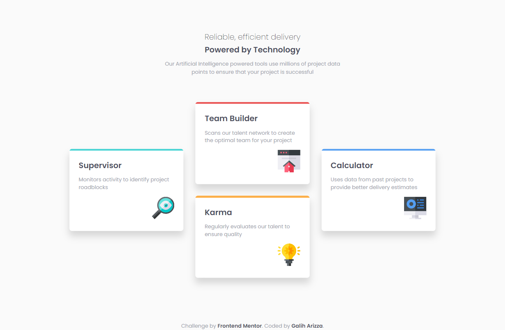

# Frontend Mentor - Four card feature section solution

This is a solution to the [Four card feature section challenge on Frontend Mentor](https://www.frontendmentor.io/challenges/four-card-feature-section-weK1eFYK). Frontend Mentor challenges help you improve your coding skills by building realistic projects.

## Table of contents

- [Overview](#overview)
  - [The challenge](#the-challenge)
  - [Screenshot](#screenshot)
  - [Links](#links)
- [My process](#my-process)
  - [Built with](#built-with)
  - [What I learned](#what-i-learned)
  - [Continued development](#continued-development)
  - [Useful resources](#useful-resources)
- [Author](#author)
- [Acknowledgments](#acknowledgments)

## Overview

### The challenge

Users should be able to:

- View the optimal layout for the site depending on their device's screen size

### Screenshot

### Links

- Solution URL: [https://github.com/chadittya/four-card-feature-section-master-react](https://github.com/chadittya/four-card-feature-section-master-react)
- Live Site URL: [https://chadittya.github.io/four-card-feature-section-master-react](https://chadittya.github.io/four-card-feature-section-master-react/)

## My process

### Built with

- Flexbox
- Mobile-first workflow
- [React](https://reactjs.org/) - JS library
- [Vite](https://vitejs.dev/) - React framework
- [Tailwind CSS](https://tailwindcss.com/) - For styles

## Author

- Github - [chadittya](https://github.com/chadittya)
- Frontend Mentor - [@chadittya](https://www.frontendmentor.io/profile/chadittya)
- Twitter - [@galiharizza](https://www.twitter.com/galiharizza)
